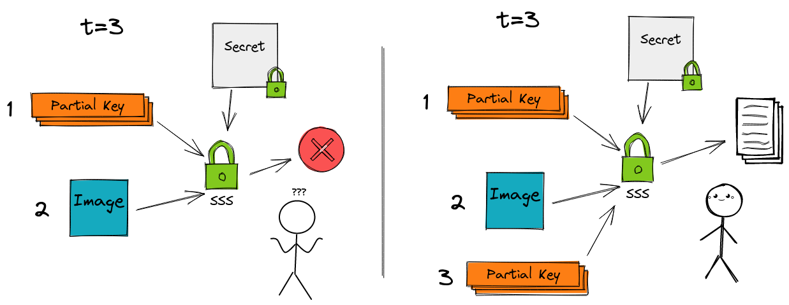

# StegoSecretS

StegoSecretS combines [AES-256](https://en.wikipedia.org/wiki/Advanced_Encryption_Standard) encryption, [Shamir's Secret Sharing (SSS)](https://en.wikipedia.org/wiki/Shamir%27s_Secret_Sharing) and [steganography](https://en.wikipedia.org/wiki/Steganography)!

It helps you splitting a secret among other peers, keeping a minimum threshold of keys to recover the original one.
The partial keys can be also be inside images, adding an additional layer of "security".

***Note:** the project is under active development. The APIs are subject to change!*

## How does it work?

An input file (or message) will be encrypted using AES-256 with a crypto secure random 32 bit key. This key will be then splitted in `p` parts with SSS (Shamir's Secret Sharing).  
A `t` threshold of partial keys is needed to recover the original key, and decrypt the secret.


For example, having 5 `parts` with a `threshold` of 3 will split the `master-key` in 5 pieces. These pieces could be also hidden into 5 images. To reconstruct the original master key at least 3 partial keys and/or images are needed.




## Usage

### encrypt

To encrypt a file:

```
stego encrypt -f mysecret.txt -p 5 -t 3
```

This will generate

```
# out
mysecret.txt.checksum
mysecret.txt.enc
mysecret.txt.enc.checksum
mysecret.txt.key

1.jpg
1.jpg.checksum
1.key
2.jpg
2.jpg.checksum
2.key
...
5.jpg
5.jpg.checksum
5.key
```

Main files:
- `mysecret.txt.checksum` is the sha256 checksum of the `mysecret.txt` file (used to check a successful decryption)
- `mysecret.txt.enc` is the encrypted file
- `mysecret.txt.enc.checksum` is the sha256 checksum of the `mysecret.txt`
- `mysecret.txt.key` is the master key used to encrypt/decrypt the secret

Partial files:
- `n.key` the `n` partial key
- `n.jpg` the `n` image where the `n` partial key is hidden
- `n.jpg.checksum` is the sha256 checksum of the `n.jpg` image

**Note*:* If no parts are specified the `master-key` will not be splitted. Keep it safely stored, or delete it.  


Checksums can be used to check the integrity of the files:

```
-> % sha256sum --check mysecret.txt.enc.checksum
mysecret.txt.enc: OK
```

### Decrypt

To decrypt a file just use enough keys and/or images

```
stego decrypt --file mysecret.txt.enc --key 1.key --key 2.key --img 3.jpg
```

also the master key alone can be used to decrypt the file
```
stego decrypt --file mysecret.txt.enc --master-key mysecret.txt.key
```


### Images

To hide the partial keys with steganography you will need a folder with some images. To get some random images the `images` command can be used. It will get some random images from https://picsum.photos/ and it will store them in a `images` folder:

```
stego images
```

---

```
stego encrypt -f/--file file.txt -p/--parts -t/--threshold -o/--output
# if no file a message can be input and embedded inside the images

stego decrypt -f/--file file.aes --master-key file.key -k/--key -i/--img
# if no file is provided the it will get the message from the images/keys
```
