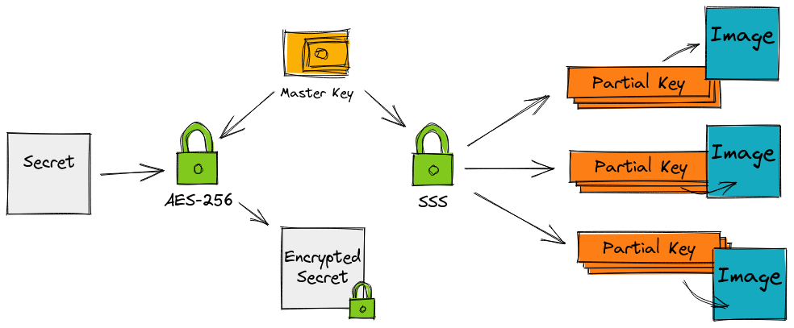

# StegoSecretS

StegoSecretS combines [AES-256](https://en.wikipedia.org/wiki/Advanced_Encryption_Standard) encryption, [Shamir's Secret Sharing (SSS)](https://en.wikipedia.org/wiki/Shamir%27s_Secret_Sharing) and [steganography](https://en.wikipedia.org/wiki/Steganography)!

It helps you splitting a secret among other peers, keeping a minimum threshold of keys to recover the original one.
The partial keys can be also be inside images, adding an additional layer of "security".

***Note:** the project is under active development. The APIs are subject to change!*

## How does it work?

An input file (or message) will be encrypted using AES-256 with a crypto secure random 32 bit key. This key will be then splitted in `p` parts with SSS (Shamir's Secret Sharing).  
A `t` threshold of partial keys is needed to recover the original key, and decrypt the secret.



For example, having 5 `parts` with a `threshold` of 3 will split the `master-key` in 5 pieces. These pieces could be also hidden into 5 images. To reconstruct the original master key at least 3 partial keys and/or images are needed.


## Usage


```
stego encrypt --file mysecret.txt --parts 5 --threshold 3

# out
mysecret.txt.enc
mysecret.txt.key
mysecret.txt.checksum

1.jpg
1.jpg.checksum
1.key
2.jpg
2.jpg.checksum
2.key
...
5.jpg
5.jpg.checksum
5.key
```

Main files:
- `file.txt.enc` the encrypted file
- `file.txt.key` the master key used to encrypt/decrypt the secret
- `file.txt.checksum` the sha256 checksum of the `file.txt.enc`

Partial files:
- `n.key` the `n` partial key
- `n.jpg` the `n` image where the partial key is hidden
- `n.jpg.checksum` the sha256 checksum of the `n.jpg` image

Either a partial key or an image can be provided to the `decrypt` command.

```
stego decrypt --file file.txt.enc --key 1.key --key 2.key --img 3.jpg
```

**Note*:* If no parts are specified the `master-key` will not be splitted. Keep it safely stored, or delete it.

```
stego decrypt --file file.txt.enc --master-key file.key -k/--key -i/--img
```


### Images

To hide the partial keys with steganography you will need a folder with some images. To get some random images the `images` command can be used. It will get some random images from https://picsum.photos/ and it will store them in a `images` folder:

```
stego images -n 10
```

---

```
stego encrypt -f/--file file.txt -p/--parts -t/--threshold -o/--output
# if no file a message can be input and embedded inside the images

stego decrypt -f/--file file.aes --master-key file.key -k/--key -i/--img
# if no file is provided the it will get the message from the images/keys
```


```
# out/file_20220102_230313
file
file.checksum // clear data checksum
file.aes // encrypted data
file.aes.checksum // encrypted data checksum
file.key // Base64 encoded master key
// Base64 Partial keys
file.1.key
file.2.key
file.3.key
image.1.jpg
image.1.jpg.checksum
image.2.jpg.checksum
image.3.jpg.checksum
```


cat 0.jpg.checksum | sha256sum --check